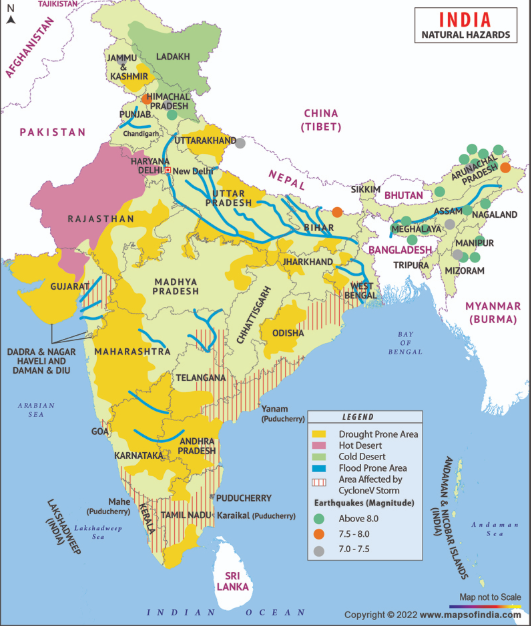

# DashShield
### Parametric Income Insurance for India's Q-Commerce Delivery Partners
**Guidewire DEVTrails 2026** · Phase 1 Submission · March 20, 2026

## The Problem

India has 8M+ platform delivery workers. Q-Commerce partners (Blinkit, Zepto, Swiggy Instamart) are the most exposed — always outdoors, always on bike, always on a 10-minute clock.

When a cyclone hits, an IMD Red Alert fires, or a sudden bandh shuts their zone — they earn ₹0 that day. No union. No sick leave. No compensation. The loss is 100% theirs.

We surveyed **25+ Blinkit and Zepto delivery workers in Bhubaneswar** to understand this firsthand. Every worker said the same thing in different words: *"Ek app bana do jo automatically paise de."* (Build something that pays us automatically.)

**DashShield is that app.**

---

## What We Built (Concept)

A parametric insurance platform where:
- Workers pay a small weekly premium
- External disruption APIs (weather, AQI, IMD, NASA) detect income-halting events
- Payouts fire **automatically** to the worker's UPI — no claim form, no waiting, no call

When a cyclone shuts Nayapalli zone at 11:00 AM, Arjun gets ₹320 on his phone by 11:01 AM. He never opened the app.

---

## Persona & Scenarios

**Target:** Q-Commerce delivery partners on Blinkit / Zepto / Swiggy Instamart, across Tier 1 and Tier 2 cities in India.

**Primary Persona — Arjun, 26, Blinkit, Bhubaneswar**

| | |
|---|---|
| Daily earnings | ₹600–900 |
| Work hours | 8–10 hrs/day, 6 days/week |
| Delivery zone | Nayapalli, Bhubaneswar |
| Financial buffer | Near zero. Borrows from family when disrupted. |
| Phone | Budget Android (Redmi/Realme), UPI active |

---

### Scenario 1 — Cyclone Red Alert (Odisha)

IMD upgrades Bhubaneswar to Red Alert at 11 AM. OpenWeatherMap confirms 41mm/hr rainfall in Nayapalli. Blinkit order density in the zone drops 96%.

```
Trigger Engine detects all 3 signals breached
  → Disruption event created: CYCLONE, Zone: Nayapalli
  → Fraud engine runs Arjun's profile: Score 9/100 → AUTO APPROVE
  → Razorpay UPI transfer: ₹320
  → Push notification to Arjun: "₹320 credited. Stay safe."
  → Time elapsed: 47 seconds
```

Arjun never filed a claim.

---

### Scenario 2 — Unplanned Bandh / Zone Curfew

A local protest blocks all roads in Mancheswar zone. No major news outlet reports it — it's a street-level blockade. The worker reports it in-app.

```
Worker taps "Report blockade" → App opens live camera (no gallery)
  → Photo captured with GPS + timestamp metadata
  → OpenCage verifies GPS is inside worker's registered zone
  → Google Maps Directions API: checks if ANY alternate route exists
  → No alternate route found → Claim approved: ₹220
```

The Google Maps validation catches fake blockade claims without needing a news API — because most Indian local bandhs are never reported in media but ARE reflected in real-time routing data.

---

### Scenario 3 — Extreme Heat (Rajasthan / UP / Telangana)

IMD issues a heat advisory for Jaipur. OpenWeatherMap confirms 44°C sustained for 3+ hours during peak delivery window. Q-commerce orders don't fully stop, but outdoor workers face forced rest.

```
OpenWeatherMap + IMD heat advisory both confirmed
  → Worker's zone matches alert zone
  → Fraud check: active platform session confirmed pre-event
  → Auto payout: ₹120
```

---

### Disruption Coverage — India's Risk Calendar



| Disruption | Data Sources | Trigger Threshold | Auto-Payout |
|---|---|---|---|
| Cyclone shutdown | IMD RSS + OpenWeatherMap | IMD Red Alert ≥ Level 2 | ₹320 |
| Flash flood | OpenWeatherMap + NASA EONET | Active flood event in zone | ₹250 |
| Heavy rain | OpenWeatherMap | >15mm/hr sustained 2hrs + order drop >60% | ₹150 |
| Extreme heat | OpenWeatherMap + IMD | >43°C sustained 3hrs | ₹120 |
| Severe AQI | AQICN + IMD advisory | AQI > 300 sustained | ₹100 |
| Curfew / Bandh | Authority feed + Google Maps | No alternate routes in zone | ₹220 |
| Festival zone closure | Local auth feed + Google Maps | Zone access blocked | ₹180 |

**Weekly payout cap: ₹700** (~1 lost workday). Economically sustainable.

**Strictly excluded:** Health, accident, vehicle repair, life insurance — income loss only.

---

## Weekly Premium Model

Gig workers are paid weekly. They think weekly. Our premium must match that.

**Base: ₹49/week**

```
Final Premium = ₹49 × Zone Risk × Season × Tenure

Zone Risk (from ML, trained on IMD + OpenWeatherMap history):
  Cyclone-coast / floodplain zone    → ×1.40  (₹68/week)
  High-risk urban zone               → ×1.15  (₹56/week)
  Standard zone                      → ×1.00  (₹49/week)
  Historically safe zone             → ×0.85  (₹41/week)

Season (auto-updated weekly):
  Monsoon Jun–Sep                    → ×1.30
  Cyclone season Oct–Nov             → ×1.25
  Heat season Apr–Jun                → ×1.15
  Clear season Dec–Mar               → ×1.00

Tenure:
  New worker < 4 weeks               → ×1.15
  Established 1–6 months             → ×1.00
  Veteran 6+ months, no fraud flag   → ×0.88
```

Workers see a plain-language reason: *"Your zone (Nayapalli) has high cyclone overlap — ₹58/week."*

A worker in Patia (lower risk) pays ₹41. A worker near Cuttack floodplain pays ₹68. The map makes this visible. The ML makes it fair.

---

## Application Workflow

```
ONBOARDING (2 minutes)
  Phone OTP login → Enter Blinkit/Zepto worker ID
  → Select delivery zone → ML scores zone risk
  → Weekly premium shown with reason
  → Pay via UPI → Policy ACTIVE

ACTIVE POLICY (background, zero worker effort)
  Trigger engine polls APIs every 15 minutes
  → Disruption detected in worker's zone
  → Fraud engine scores the claim
  → AUTO APPROVE: UPI payout in < 60 seconds
  → FLAGGED: 50% partial payout + 2-hour human review

WORKER DASHBOARD
  Active policy status · Payout history · Zone risk level
  Live disruption alerts · Next premium due

ADMIN DASHBOARD
  Live India zone map with disruption overlays
  Claim queue (approved / flagged / rejected)
  Loss ratio per zone · Fraud ring alerts
  Predictive widget: "Zone X — 72% rain risk next week"
```

---

## Platform Choice — Progressive Web App (PWA)

**Web, not native app.** Reasons grounded in our survey findings:

- Workers use budget Android phones with limited storage — app install friction is real
- PWA works via browser link, no Play Store, no install required
- Camera, GPS, push notifications all work via browser APIs on Android Chrome
- Single Next.js codebase serves both the worker PWA and the admin dashboard
- Faster to build and deploy — critical for a 6-week hackathon

---

## AI / ML Integration

### 1. Dynamic Premium Calculator
**Model:** Random Forest Regressor
**Trained on:** 25 real survey responses (Bhubaneswar workers) + synthetic augmentation ×50 + 3 years IMD zonal disruption history

Features: zone flood/heat/cyclone history scores, worker tenure, rolling 30-day zone claim rate, current season index.

Output: weekly premium (₹35–85) + plain-language reason string.

### 2. Fraud Detection Engine
**Model:** Isolation Forest (unsupervised — works without labeled fraud data at cold start)

Features analyzed per claim:
- Was worker's platform session active 2 hours before the event?
- Does claim zone match registered zone?
- How many claims has this worker filed in 7 days?
- What % of this zone's policyholders are claiming simultaneously?
- How many independent APIs confirmed the disruption?
- Was this policy purchased within 48 hours of the event?

Output: Fraud score 0–100 → Auto approve / Manual review / Auto reject.

### 3. Contextual Authenticity Score (Anti-Spoofing)
**Model:** XGBoost Classifier

Catches GPS spoofing by reading physical-layer signals that app-level tools cannot fake:
- Cell tower pincode vs GPS zone (carrier-level, unfakeable by apps)
- Accelerometer pattern vs claimed location
- Network stability vs weather severity
- Active delivery order session existence

Output: CAS score 0.0–1.0. Combined with fraud score for final decision.

---

## Adversarial Defense — Anti-Spoofing Strategy

The DEVTrails security bulletin described a Telegram-coordinated GPS spoofing syndicate draining a parametric platform. DashShield's defense is not a single check — it is **six simultaneous signals**.

**Why six signals?** A spoofer can fake GPS. They cannot simultaneously fake: (1) platform activity history, (2) cell tower location, (3) zone cohort claim timing, (4) multi-API weather confirmation, (5) new policy timing, and (6) timestamp clustering pattern — all at once.

| Signal | What It Catches |
|---|---|
| Platform activity gap | Workers who weren't active before the event |
| Zone cohort spike | Syndicate swarms — 95%+ zone claiming in <5 minutes |
| Multi-source confirmation | Fake disruptions — GPS can't make it rain on OpenWeatherMap |
| Cell tower vs GPS mismatch | Basic GPS spoofing apps |
| 48-hour policy window | Storm-forecast opportunistic fraud |
| Timestamp clustering | Telegram-coordinated simultaneous submissions |

**For honest workers who get flagged:** 50% partial payout released immediately. 2-hour review SLA. If OpenWeatherMap confirms red-alert in their zone, a weak cell signal is treated as *corroborating* evidence, not suspicious. Wrong rejections get ₹50 goodwill credit.

Full hard reject requires: CAS < 0.55 **AND** ring flag simultaneously. Dual-condition gate prevents false positives.

---

## Tech Stack

| Layer | Technology |
|---|---|
| Frontend | Next.js 14 · Tailwind CSS · shadcn/ui · Recharts · Leaflet.js |
| Backend | Python FastAPI (async) · SQLAlchemy · Pydantic · JWT auth |
| ML | scikit-learn (Random Forest · Isolation Forest) · XGBoost |
| Trigger Engine | APScheduler (cron every 15min) · tenacity (circuit breaker) |
| Database | PostgreSQL |
| Cache | Redis via Upstash (free tier) — circuit breaker weather fallback |
| Payments | Razorpay Test Mode — mock UPI payout |
| Weather | OpenWeatherMap API (free tier) |
| Cyclone alerts | IMD RSS Feed (free, government) |
| AQI | AQICN API (free tier) |
| Disaster events | NASA EONET API (free) |
| Geocoding | OpenCage API (free tier) |
| Route validation | Google Maps Directions API |
